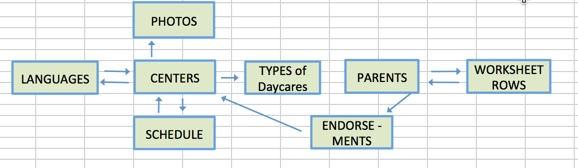

#<strong>Little Turtles Childcare Finder</strong>

COMING SOON: Deployed app on Heroku

<strong>Technology Stack:</strong>
Python, Flask, SQLite3, SQLAlchemy, Jinja, Javascript, Jquery, Ajax, HTML, CSS, Bootstrap

This is my <strong>final project for Hackbright Academy</strong> and was a solo project built over a four week period using Python and a Flask web framework. 

<strong>Objective: </strong>
The purpose of this daycare finder app is to help parents research and choose daycares that meet their individual needs. 

<strong>Features:</strong>
<ul><li>advanced search functionality</li>
<li>secure parent profile page</li>
<li>worksheet to help parents record and track their findings</li>
<li>parent endorsements of daycares</li>
<li>individual daycare profiles with carousel of images</li>
<li>daycare owners can create and manage their own business profile</li>
</ul>

<strong>Data Model:</strong> (model.py)

I used SQLite and SQLAlchemy to create a database with <strong>8 tables</strong>. Relationships are key to my data so I selected these technologies to create a relational database. The arrows in the image below indicate how the data tables connect, dual arrows between two tables are intended to illustrate a <strong>many-to-many relationship</strong>.

<strong>Page Views (12 unique views):</strong>

<strong>Public page views</strong> (user not logged in)

<strong>Parent page views</strong> (parent logged into site)

<strong>Daycare owner page views</strong> (owner logged into business profile)

<strong>Sample Pages:</strong>

<strong>Advanced Search Page</strong>

<strong>Parent Worksheet</strong>


<strong>Tech Note: I used a Jquery library called Jeditable to enable the user to make in-place edits to either their worksheet (parents), or their profile page (daycare owners). This feature also required AJAX and Javascript to complete the functionality.</strong>


