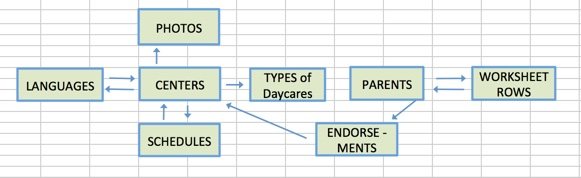
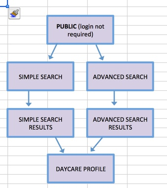
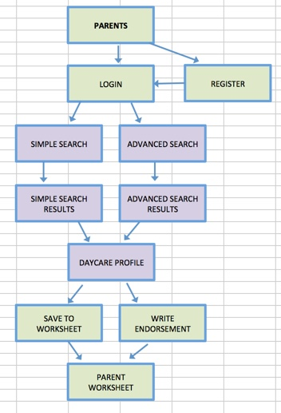
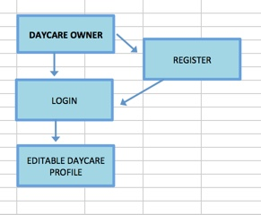
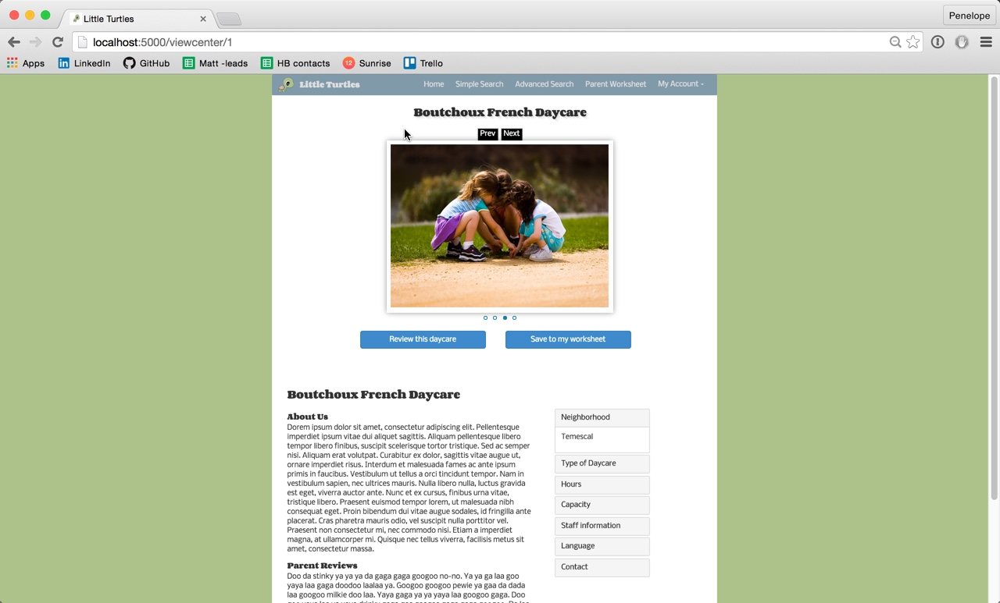
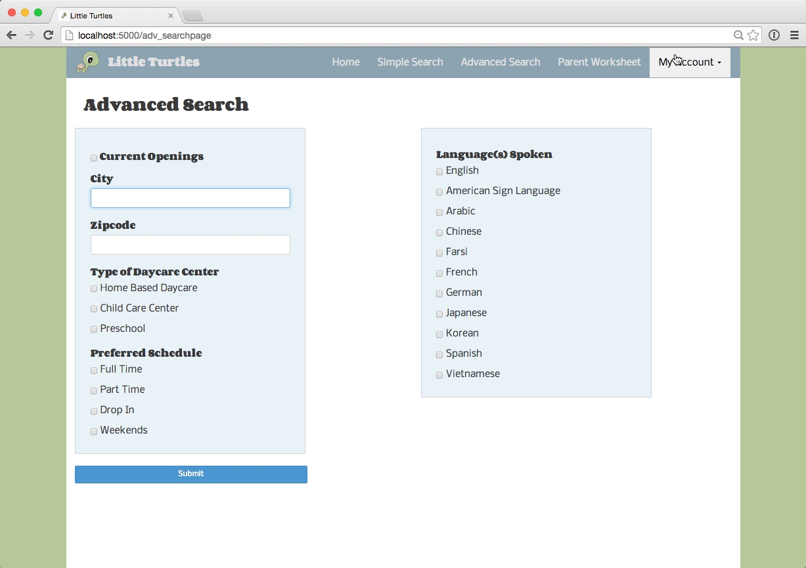
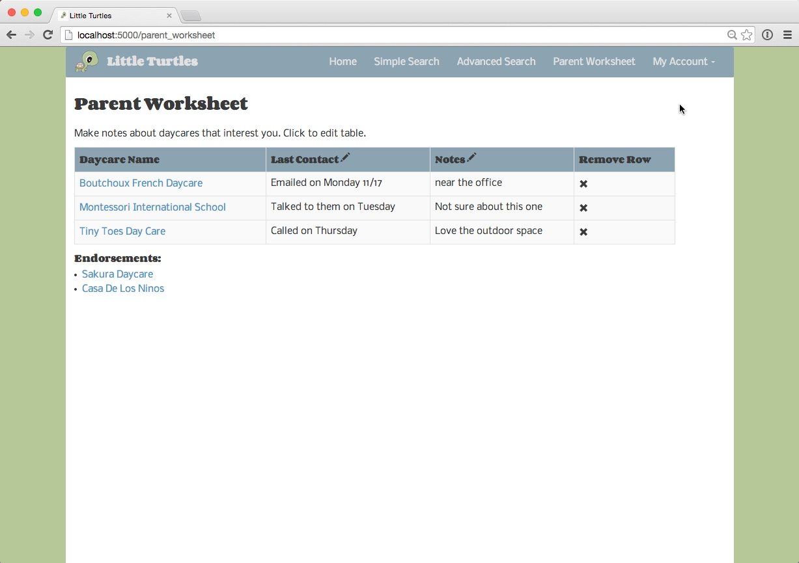

#<strong>Little Turtles Childcare Finder</strong>

COMING SOON: Deployed app on Heroku

<strong>Technology Stack:</strong>
Python, Flask, SQLite3, SQLAlchemy, Jinja, Javascript, Jquery, Ajax, HTML, CSS, Bootstrap

This is my <strong>final project for Hackbright Academy</strong> and was a solo project built over a four week period using Python and Flask. 

<strong>Objective: </strong>
The purpose of this daycare finder app is to help parents research and choose daycares that meet their individual needs. 

<strong>Features:</strong>
<ul><li>user can filter search by location, schedule, etc</li>
<li>user signup and login</li>
<li>editable worksheet to help parents record and track their daycare search progress</li>
<li>parents can endorse daycares</li>
<li>individual daycare profiles with carousel of images</li>
<li>daycare owners can create and manage their own business profile</li>
</ul>

<strong>Data Model:</strong> (model.py)

I used SQLite3 and SQLAlchemy to create a database with <strong>8 tables</strong>. Relationships are key to my data so I selected these technologies to create a relational database. The arrows in the image below indicate how the data tables connect, dual arrows between two tables are intended to illustrate a <strong>many-to-many relationship</strong>.

####Page Views (12 unique views):
***

#####<strong>Public page view flow</strong> (user not logged in)

#####<strong>Parent page view flow</strong> (parent logged into site)

#####<strong>Daycare owner page view flow</strong> (owner logged into business profile)

***

###Sample Pages:

####<strong>Daycare Profile Page</strong>


####<strong>Advanced Search Page</strong>

####<strong>Parent Worksheet</strong>


<strong>Tech Note:</strong> I used a Jquery library called Jeditable to enable the user to make in-place edits to either their worksheet (parents), or their profile page (daycare owners). This feature required AJAX and Javascript to complete the functionality.


